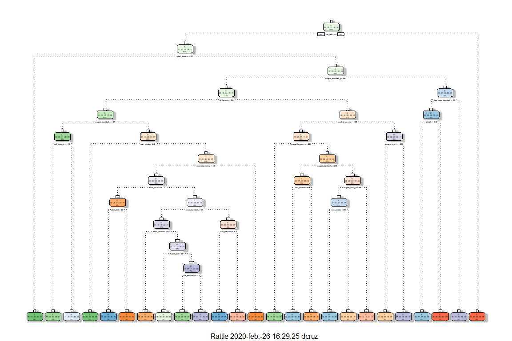
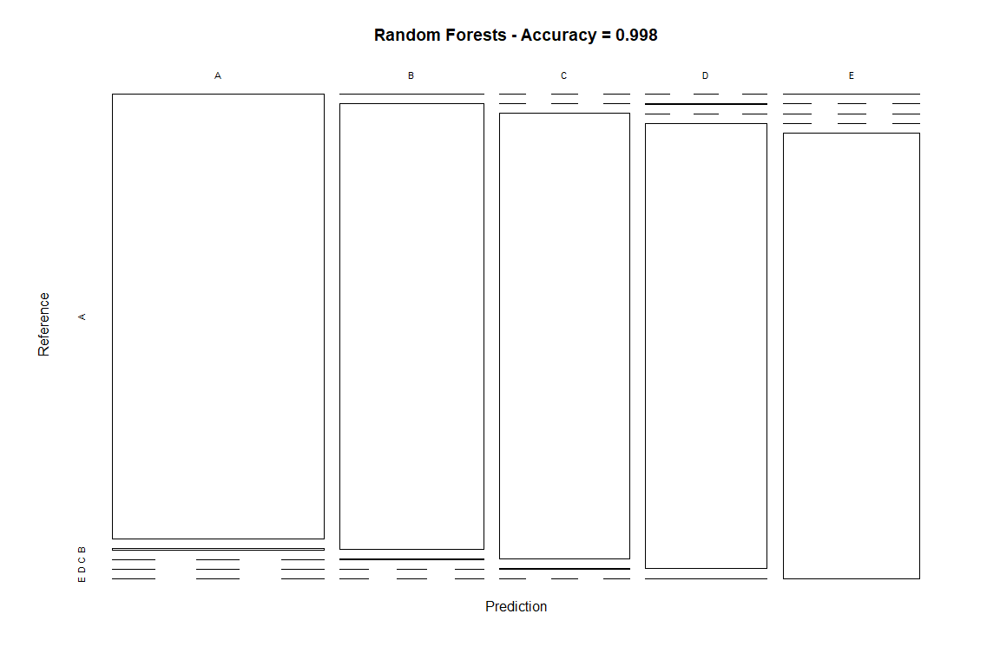

# Summary

This document is prepared as a part of the Data Science specialization from the 
John Hopkins University and Coursera, in the Practical Machine Learning course. 
The data set consists of measurements of devices from individuals performing 
weight lifting excercises, either in one correct fashion, or four incorrect 
ones. The objective is to use a training data set and machine learning 
algorithms to predict from these measurements in a testing data set. This 
document serves both for the peer-graded assignment, and for the course project 
prediction quiz.

# Data Overview

The subjects were tracked during weightliftinf excersises, and sensors were 
located in their arms, forearms, and belt areas, and a sensor was also 
positioned in the dumbells. Several three-dimensional measurements were taken 
while the participants did dumbbell biceps curls, in five different fashions 
(classes):

* Classe A: exactly according to the specification.
* Classe B: throwing the elbows to the front.
* Classe C: lifting the dumbbell only halfway.
* Classe D: lowering the dumbbell only halfway.
* Classe E: throwing the hips to the front.

More on the dataset can be read in 
[this link](http://groupware.les.inf.puc-rio.br/har#ixzz3xsbS5bVX).

We'll be working with personal data from smart devices which 
capture a person's movement to track their activity. We'll be working with the 
training data, and testing our results on the testing data, using the `caret` 
package in R. The goal for this project is to predict the manner in which the 
excercise was  made, `classe` variable, using the rest of the variables.


The training data from our set contains 19622 observations of 
160 variables. Here's a table on how many variables for 
each class for each user were taken, in our training data set.

<table class="table table-striped" style="width: auto !important; margin-left: auto; margin-right: auto;">
<caption>Users-Classe</caption>
 <thead>
  <tr>
   <th style="text-align:left;">   </th>
   <th style="text-align:right;"> A </th>
   <th style="text-align:right;"> B </th>
   <th style="text-align:right;"> C </th>
   <th style="text-align:right;"> D </th>
   <th style="text-align:right;"> E </th>
  </tr>
 </thead>
<tbody>
  <tr>
   <td style="text-align:left;"> adelmo </td>
   <td style="text-align:right;"> 1165 </td>
   <td style="text-align:right;"> 776 </td>
   <td style="text-align:right;"> 750 </td>
   <td style="text-align:right;"> 515 </td>
   <td style="text-align:right;"> 686 </td>
  </tr>
  <tr>
   <td style="text-align:left;"> carlitos </td>
   <td style="text-align:right;"> 834 </td>
   <td style="text-align:right;"> 690 </td>
   <td style="text-align:right;"> 493 </td>
   <td style="text-align:right;"> 486 </td>
   <td style="text-align:right;"> 609 </td>
  </tr>
  <tr>
   <td style="text-align:left;"> charles </td>
   <td style="text-align:right;"> 899 </td>
   <td style="text-align:right;"> 745 </td>
   <td style="text-align:right;"> 539 </td>
   <td style="text-align:right;"> 642 </td>
   <td style="text-align:right;"> 711 </td>
  </tr>
  <tr>
   <td style="text-align:left;"> eurico </td>
   <td style="text-align:right;"> 865 </td>
   <td style="text-align:right;"> 592 </td>
   <td style="text-align:right;"> 489 </td>
   <td style="text-align:right;"> 582 </td>
   <td style="text-align:right;"> 542 </td>
  </tr>
  <tr>
   <td style="text-align:left;"> jeremy </td>
   <td style="text-align:right;"> 1177 </td>
   <td style="text-align:right;"> 489 </td>
   <td style="text-align:right;"> 652 </td>
   <td style="text-align:right;"> 522 </td>
   <td style="text-align:right;"> 562 </td>
  </tr>
  <tr>
   <td style="text-align:left;"> pedro </td>
   <td style="text-align:right;"> 640 </td>
   <td style="text-align:right;"> 505 </td>
   <td style="text-align:right;"> 499 </td>
   <td style="text-align:right;"> 469 </td>
   <td style="text-align:right;"> 497 </td>
  </tr>
</tbody>
</table>

# Training our data

For this excersise, we will be implementing three algorithm approaches: (1) 
predicting with trees, (2) random forests, and (3) boosting. We will be 
combining our predictors, and compare which one fares better for predicting 
the classe of the weight lifting excersice based on the sensors measurements. 

Keep in mind that we have to prepare our daa, and trim it as much as we can for 
computational reasons.


```
## [1] 13737    54
```

```
## [1] 5885   54
```

We first partitioned our training data into two, so as to have a validation 
set, which is possible due to having a large number of observations. We then 
trim our variables, first by eliminating zero variance predictors using the 
`nearZerovar()` function. We then removed variables with a high proportion of 
`NA` values. Finally, we eliminated the first five variables, which contained 
identification values, with no predictive use. From this data set, we created 
our partition which contained 53 predictors.

## Regression Trees

The idea behind predicting with trees is that if you have a bunch of variables, 
you can take each of those variables, and use it to split the outcome into 
different groups. As you split the outcomes into different groups, you can 
evaluate the homogeneity of the outcome within each group, and continue to 
split again if necessary, until you get outcomes that are separated into groups 
that are homogeneous enough, or that they are small enough that you need to 
stop.

We well be using the `rpart` package and the `rpart()` function to train our 
model, and to select trees, we will be using the `rpart` method. The results 
of our model looks as follows:

<!-- -->

That's how our fancy model tree looks like. Now let's test our model with our 
testing set partition from the testing data. Remember, we will use the testing 
data until the very end.

<table class="table table-striped" style="width: auto !important; margin-left: auto; margin-right: auto;">
<caption>Overall Statistics</caption>
 <thead>
  <tr>
   <th style="text-align:left;">   </th>
   <th style="text-align:right;"> Value </th>
  </tr>
 </thead>
<tbody>
  <tr>
   <td style="text-align:left;"> Accuracy </td>
   <td style="text-align:right;"> 0.7639762 </td>
  </tr>
  <tr>
   <td style="text-align:left;"> Kappa </td>
   <td style="text-align:right;"> 0.6998440 </td>
  </tr>
  <tr>
   <td style="text-align:left;"> AccuracyLower </td>
   <td style="text-align:right;"> 0.7529128 </td>
  </tr>
  <tr>
   <td style="text-align:left;"> AccuracyUpper </td>
   <td style="text-align:right;"> 0.7747773 </td>
  </tr>
  <tr>
   <td style="text-align:left;"> AccuracyNull </td>
   <td style="text-align:right;"> 0.2844520 </td>
  </tr>
  <tr>
   <td style="text-align:left;"> AccuracyPValue </td>
   <td style="text-align:right;"> 0.0000000 </td>
  </tr>
  <tr>
   <td style="text-align:left;"> McnemarPValue </td>
   <td style="text-align:right;"> 0.0000000 </td>
  </tr>
</tbody>
</table>

<!-- -->


## Random Forests

With random forest, the idea is to bootstrap samples, take a resample of 
observed data and training data, and rebuild classification or regression 
trees on each bootstrap sample. For random forests, we need the 
`random forest` package which can be used in conjunction with the `train()` 
function from the `caret` package.

<table class="table table-striped" style="width: auto !important; margin-left: auto; margin-right: auto;">
<caption>Overall Statistics</caption>
 <thead>
  <tr>
   <th style="text-align:left;">   </th>
   <th style="text-align:right;"> Value </th>
  </tr>
 </thead>
<tbody>
  <tr>
   <td style="text-align:left;"> Accuracy </td>
   <td style="text-align:right;"> 0.9979609 </td>
  </tr>
  <tr>
   <td style="text-align:left;"> Kappa </td>
   <td style="text-align:right;"> 0.9974207 </td>
  </tr>
  <tr>
   <td style="text-align:left;"> AccuracyLower </td>
   <td style="text-align:right;"> 0.9964408 </td>
  </tr>
  <tr>
   <td style="text-align:left;"> AccuracyUpper </td>
   <td style="text-align:right;"> 0.9989459 </td>
  </tr>
  <tr>
   <td style="text-align:left;"> AccuracyNull </td>
   <td style="text-align:right;"> 0.2844520 </td>
  </tr>
  <tr>
   <td style="text-align:left;"> AccuracyPValue </td>
   <td style="text-align:right;"> 0.0000000 </td>
  </tr>
  <tr>
   <td style="text-align:left;"> McnemarPValue </td>
   <td style="text-align:right;"> NaN </td>
  </tr>
</tbody>
</table>

<!-- -->

## Boosting

The idea behind boosting is taking a bunch of possibly weak predictors, and 
weighting them up so as to potentiate their strengths, and add them up. We 
will be using the `gmb` package along with `caret` to train our model.

<table class="table table-striped" style="width: auto !important; margin-left: auto; margin-right: auto;">
<caption>Overall Statistics</caption>
 <thead>
  <tr>
   <th style="text-align:left;">   </th>
   <th style="text-align:right;"> Value </th>
  </tr>
 </thead>
<tbody>
  <tr>
   <td style="text-align:left;"> Accuracy </td>
   <td style="text-align:right;"> 0.9879354 </td>
  </tr>
  <tr>
   <td style="text-align:left;"> Kappa </td>
   <td style="text-align:right;"> 0.9847353 </td>
  </tr>
  <tr>
   <td style="text-align:left;"> AccuracyLower </td>
   <td style="text-align:right;"> 0.9848062 </td>
  </tr>
  <tr>
   <td style="text-align:left;"> AccuracyUpper </td>
   <td style="text-align:right;"> 0.9905658 </td>
  </tr>
  <tr>
   <td style="text-align:left;"> AccuracyNull </td>
   <td style="text-align:right;"> 0.2844520 </td>
  </tr>
  <tr>
   <td style="text-align:left;"> AccuracyPValue </td>
   <td style="text-align:right;"> 0.0000000 </td>
  </tr>
  <tr>
   <td style="text-align:left;"> McnemarPValue </td>
   <td style="text-align:right;"> NaN </td>
  </tr>
</tbody>
</table>

<!-- -->

## Model Comparison

As shown in the previous table, Random Forests fares better than boosting and 
than regression trees, though boosting also has a high accuracy. Let's try 
combining the random forests model with boosting to see if we can kick the 
accuracy up a notch. We'll be using the generalized additive models with 
integrated smoothness estimation.

# Applying selected model

<table class="table table-striped" style="width: auto !important; margin-left: auto; margin-right: auto;">
<caption>Models' accuracy</caption>
 <thead>
  <tr>
   <th style="text-align:left;"> Model </th>
   <th style="text-align:right;"> Accuracy </th>
  </tr>
 </thead>
<tbody>
  <tr>
   <td style="text-align:left;"> Regression Trees </td>
   <td style="text-align:right;"> 0.7640 </td>
  </tr>
  <tr>
   <td style="text-align:left;"> Random Forests </td>
   <td style="text-align:right;"> 0.9980 </td>
  </tr>
  <tr>
   <td style="text-align:left;"> Boosting </td>
   <td style="text-align:right;"> 0.9879 </td>
  </tr>
</tbody>
</table>

Once we've chosen our model, we'll be using our testing data and predict to 
which class does the weight lifting observation corresponds. According to our 
previous models, random forests had the highest accuracy, so that'll be the 
model we will pick.

So, once we use random forests, we get that the testing data corresponds to 
the following activities

<table class="table table-striped" style="width: auto !important; margin-left: auto; margin-right: auto;">
<caption>Testing data prediction using Random Forests</caption>
 <thead>
  <tr>
   <th style="text-align:left;"> X </th>
   <th style="text-align:left;"> User Name </th>
   <th style="text-align:left;"> Classe Prediction </th>
  </tr>
 </thead>
<tbody>
  <tr>
   <td style="text-align:left;"> 1 </td>
   <td style="text-align:left;"> pedro </td>
   <td style="text-align:left;"> B </td>
  </tr>
  <tr>
   <td style="text-align:left;"> 2 </td>
   <td style="text-align:left;"> jeremy </td>
   <td style="text-align:left;"> A </td>
  </tr>
  <tr>
   <td style="text-align:left;"> 3 </td>
   <td style="text-align:left;"> jeremy </td>
   <td style="text-align:left;"> B </td>
  </tr>
  <tr>
   <td style="text-align:left;"> 4 </td>
   <td style="text-align:left;"> adelmo </td>
   <td style="text-align:left;"> A </td>
  </tr>
  <tr>
   <td style="text-align:left;"> 5 </td>
   <td style="text-align:left;"> eurico </td>
   <td style="text-align:left;"> A </td>
  </tr>
  <tr>
   <td style="text-align:left;"> 6 </td>
   <td style="text-align:left;"> jeremy </td>
   <td style="text-align:left;"> E </td>
  </tr>
  <tr>
   <td style="text-align:left;"> 7 </td>
   <td style="text-align:left;"> jeremy </td>
   <td style="text-align:left;"> D </td>
  </tr>
  <tr>
   <td style="text-align:left;"> 8 </td>
   <td style="text-align:left;"> jeremy </td>
   <td style="text-align:left;"> B </td>
  </tr>
  <tr>
   <td style="text-align:left;"> 9 </td>
   <td style="text-align:left;"> carlitos </td>
   <td style="text-align:left;"> A </td>
  </tr>
  <tr>
   <td style="text-align:left;"> 10 </td>
   <td style="text-align:left;"> charles </td>
   <td style="text-align:left;"> A </td>
  </tr>
  <tr>
   <td style="text-align:left;"> 11 </td>
   <td style="text-align:left;"> carlitos </td>
   <td style="text-align:left;"> B </td>
  </tr>
  <tr>
   <td style="text-align:left;"> 12 </td>
   <td style="text-align:left;"> jeremy </td>
   <td style="text-align:left;"> C </td>
  </tr>
  <tr>
   <td style="text-align:left;"> 13 </td>
   <td style="text-align:left;"> eurico </td>
   <td style="text-align:left;"> B </td>
  </tr>
  <tr>
   <td style="text-align:left;"> 14 </td>
   <td style="text-align:left;"> jeremy </td>
   <td style="text-align:left;"> A </td>
  </tr>
  <tr>
   <td style="text-align:left;"> 15 </td>
   <td style="text-align:left;"> jeremy </td>
   <td style="text-align:left;"> E </td>
  </tr>
  <tr>
   <td style="text-align:left;"> 16 </td>
   <td style="text-align:left;"> eurico </td>
   <td style="text-align:left;"> E </td>
  </tr>
  <tr>
   <td style="text-align:left;"> 17 </td>
   <td style="text-align:left;"> pedro </td>
   <td style="text-align:left;"> A </td>
  </tr>
  <tr>
   <td style="text-align:left;"> 18 </td>
   <td style="text-align:left;"> carlitos </td>
   <td style="text-align:left;"> B </td>
  </tr>
  <tr>
   <td style="text-align:left;"> 19 </td>
   <td style="text-align:left;"> pedro </td>
   <td style="text-align:left;"> B </td>
  </tr>
  <tr>
   <td style="text-align:left;"> 20 </td>
   <td style="text-align:left;"> eurico </td>
   <td style="text-align:left;"> B </td>
  </tr>
</tbody>
</table>

# Apendix - Code Chunks
1. Used libraries

```r
library(caret); library(dplyr); library(ggplot2); library(kableExtra);
library(randomForest); library(rpart.plot); library(rattle); library(mgcv); 
library(corrplot)
```

2. Reading the data

```r
training <- 
     read.csv(".\\Data\\pml-training.csv", header = TRUE)

testing <- 
     read.csv(".\\Data\\pml-testing.csv", header = TRUE)
```

3. User - Classe table

```r
t1 <- table(training$user_name, training$classe)
kable(t1, 
      caption = "Users-Classe") %>%
  kable_styling(bootstrap_options = "striped", full_width = FALSE, 
                latex_options = "hold_position")
```

4. Preparing the data

```r
# Remove variables with near zero variance
nzv <- nearZeroVar(training)
training <- training[, -nzv]

# Remove variables with mostly NA
isNA <- sapply(training, function(x) mean(is.na(x))) > 0.95
training <- training[, isNA == FALSE]

# Remove id Variables
training <- training[, -(1:5)]

# Create a partition so to have a validation set
set.seed(950)
inTrain  <- createDataPartition(training$classe, p = 0.7, list = FALSE)

trainSet <- training[inTrain, ]
testSet <- training[-inTrain, ]

dim(trainSet); dim(testSet)
```

5. Regression Trees model

```r
set.seed(135)

ModelTree <- rpart(classe ~ ., data = trainSet, method = "class")
fancyRpartPlot(ModelTree)
```

6. Regression Trees predictions

```r
# Predicting
predTree <- predict(ModelTree, newdata = testSet, type = "class")
confTree <- confusionMatrix(predTree, testSet$classe)
tree_overall <- as.data.frame(confTree$overall)
names(tree_overall) <- c("Value")

kable(tree_overall, 
      caption = "Overall Statistics") %>%
  kable_styling(bootstrap_options = "striped", full_width = FALSE, 
                latex_options = "hold_position")

# Plotting decission tree
plot(confTree$table, col = confTree$byClass, 
     main = paste("Decision Tree - Accuracy =",
                  round(confTree$overall["Accuracy"], 4)))
```

7. Random Forests model and predictions

```r
set.seed(215)
tControl <- trainControl(method="cv", number=3, verboseIter=FALSE)
ModelRF <- train(classe ~ ., data=trainSet, method="rf",
                          trControl = tControl)

# Predicting
predRF <- predict(ModelRF, newdata = testSet)
confRF <- confusionMatrix(predRF, testSet$classe)
RF_overall <- as.data.frame(confRF$overall)
names(RF_overall) <- c("Value")

kable(RF_overall, 
      caption = "Overall Statistics") %>%
  kable_styling(bootstrap_options = "striped", full_width = FALSE, 
                latex_options = "hold_position")

# Plotting decission tree
plot(confRF$table, col = confRF$byClass, 
     main = paste("Random Forests - Accuracy =",
                  round(confRF$overall["Accuracy"], 4)))
```

8. Boosting model and predictions

```r
set.seed(122814)
bControl <- trainControl(method = "repeatedcv", number = 5, repeats = 1)
ModelGBM <- train(classe ~ ., data=trainSet, method="gbm",
                          trControl = tControl, verbose = FALSE)

# Predicting
predGBM <- predict(ModelGBM, newdata = testSet)
confGBM <- confusionMatrix(predGBM, testSet$classe)
GBM_overall <- as.data.frame(confGBM$overall)
names(GBM_overall) <- c("Value")

kable(GBM_overall, 
      caption = "Overall Statistics") %>%
  kable_styling(bootstrap_options = "striped", full_width = FALSE, 
                latex_options = "hold_position")

# Plotting decission tree
plot(confGBM$table, col = confGBM$byClass, 
     main = paste("Boosting - Accuracy =",
                  round(confGBM$overall["Accuracy"], 4)))
```

9. Model Comparison table

```r
Accuracy <- data.frame(Model = 
                            c("Regression Trees", 
                              "Random Forests", 
                              "Boosting"), 
                       Accuracy = 
                            c(round(confTree$overall["Accuracy"], 4), 
                              round(confRF$overall["Accuracy"], 4), 
                              round(confGBM$overall["Accuracy"], 4))
                       )
kable(Accuracy, 
      caption = "Models' accuracy") %>%
  kable_styling(bootstrap_options = "striped", full_width = FALSE, 
                latex_options = "hold_position")
```

10. Applying Random Forests to test data

```r
predTesting <- predict(ModelRF, newdata = testing)
table <- cbind(testing$X, as.character(testing$user_name), 
               as.character(predTesting))
colnames(table) <- c("X", "User Name", "Classe Prediction")


kable(table, 
      caption = "Testing data prediction using Random Forests") %>%
  kable_styling(bootstrap_options = "striped", full_width = FALSE, 
                latex_options = "hold_position")
```
